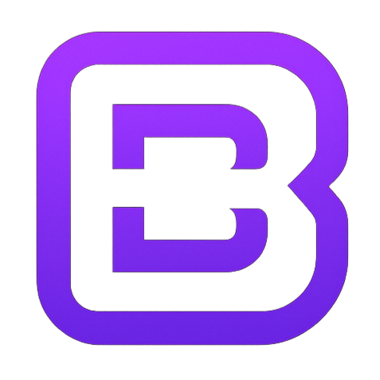

# ByteCode IDE

<p align="center">
  
</p>

<p align="center">
  <strong>A modern, powerful code editor with built-in AI assistant</strong>
</p>

<p align="center">
  <a href="https://github.com/ByteCode-Team/ByteCode/releases">
    
  </a>
  <a href="LICENSE">
    
  </a>
  <a href="https://github.com/ByteCode-Team/ByteCode/issues">
    
  </a>
</p>

---

## ✨ Features

- **🤖 AI-Powered Assistant** - Get intelligent code suggestions, explanations, and refactoring help from multiple AI providers (Claude, GPT-4, Gemini, Groq, Ollama, and more)
- **⚡ Lightning Fast** - Built on Monaco Editor (the same engine as VS Code), delivering a smooth, responsive editing experience
- **🎨 Beautiful Interface** - Clean, modern dark theme with syntax highlighting for 50+ languages
- **🔌 Extensible** - Create and install extensions with our simple `.bcext` format
- **💻 Integrated Terminal** - Run commands, scripts, and manage your project without leaving the editor
- **🌍 Multi-Language** - Available in English and French, with more languages coming soon
- **📁 Smart File Explorer** - Browse and manage your project files with ease
- **💾 Auto-Save** - Never lose your work with automatic file saving

## 📸 Screenshot

<p align="center">
  
</p>

## 🚀 Getting Started

### Download

Download the latest release from our [releases page](https://github.com/ByteCode-Team/ByteCode/releases).

### Build from Source

```bash
# Clone the repository
git clone https://github.com/ByteCode-Team/ByteCode.git
cd ByteCode

# Install dependencies
npm install

# Run in development mode
npm start

# Build for production
npm run dist
```

### Requirements

- Windows 10/11 (64-bit)
- Node.js 18+ (for development)

## 🤖 AI Providers

ByteCode supports multiple AI providers:

| Provider | API Key Required | Cost |
|----------|-----------------|------|
| **Puter.js** | No | Free (limited) |
| **Ollama** | No | Free (local) |
| **LM Studio** | No | Free (local) |
| **Groq** | Yes | Free tier available |
| **OpenAI** | Yes | Paid |
| **Claude** | Yes | Paid |
| **Gemini** | Yes | Free tier available |
| **OpenRouter** | Yes | Varies |

### Setting up AI

1. Open ByteCode
2. Click the AI toggle button (🤖) in the sidebar
3. Click the settings icon (⚙️) in the AI panel
4. Select your preferred provider
5. Enter your API key (if required)
6. Choose your model

## 🔌 Extensions

ByteCode supports a simple extension system. Extensions are `.bcext` files (ZIP format) containing:

- `manifest.json` - Extension metadata
- `index.js` - Main extension code

### Creating an Extension

```json
// manifest.json
{
    "id": "my-extension",
    "name": "My Extension",
    "version": "1.0.0",
    "description": "A sample extension",
    "author": "Your Name",
    "main": "index.js"
}
```

```javascript
// index.js
bytecode.ui.showNotification('Hello from my extension!', 'info');
```

See the [extensions documentation](extensions/README.md) for more details.

## 🌐 Keyboard Shortcuts

| Action | Shortcut |
|--------|----------|
| Save | `Ctrl+S` |
| Open File | `Ctrl+O` |
| Open Folder | `Ctrl+Shift+O` |
| New File | `Ctrl+N` |
| Find | `Ctrl+F` |
| Replace | `Ctrl+H` |
| Toggle Terminal | `Ctrl+\`` |
| Toggle AI Panel | `Ctrl+Shift+A` |
| Command Palette | `Ctrl+Shift+P` |

## 🛠️ Tech Stack

- **Electron** - Cross-platform desktop app framework
- **Monaco Editor** - The code editor that powers VS Code
- **Node.js** - JavaScript runtime
- **xterm.js** - Terminal emulation

## 📝 License

This project is licensed under the MIT License - see the [LICENSE](LICENSE) file for details.

## 🤝 Contributing

Contributions are welcome! Please read our [Contributing Guide](CONTRIBUTING.md) for details on how to submit pull requests, report issues, and contribute to the project.

## 💬 Community

- [GitHub Issues](https://github.com/ByteCode-Team/ByteCode/issues) - Bug reports and feature requests
- [GitHub Discussions](https://github.com/ByteCode-Team/ByteCode/discussions) - Questions and community discussions

## 👥 Team

Made with ❤️ by the [ByteCode Team](https://github.com/ByteCode-Team)

---

<p align="center">
  <sub>⭐ Star us on GitHub if you find ByteCode useful!</sub>
</p>
